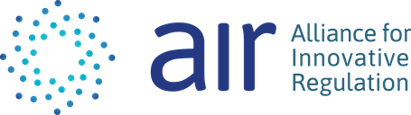

## The Problem
After nearly disappearing in the ’90s, the spread of child sexual imagery exploded with the rise of the internet. Reports of CSAM (child sexual abuse material) online have increased 15,000% over the last 15 years, tripling between 2017 and 2019 alone. In the tech world, only a handful of companies have the resources and expertise to meet the challenge

Cryptocurrency is a fast-growing method for purchasing CSAM. Buyers use crypto because it is anonymous like cash, but works online. Current anti-money laundering and law enforcement techniques struggle to detect these crimes. 

## The TechSprint
In October 2020, AIR held a virtual TechSprint to find high-tech ways to help. The techsprint tackled this Problem Statement: Can we curtail CSAM by detecting users through their cryptocurrency payment activities, without compromising the privacy and data security of innocent people? 

Teams came from law enforcement, banks, cryptocurrency firms, regulatory agencies, and crypto-analytics companies in three countries. A range of solutions was presented on Demo Day, and the response from the judges was that each prototype showed promise and that if combined, the solution could easily be leveraged by FinCEN and law enforcement agencies.

## Project Goals and Updates
A project team has assembled to continue building upon the solutions that were seeded during the TechSprint. The project roadmap will be drafted and a backlog created in accordance with the requirements identified by FinCEN to ensure that the solution can easily be integrated and utilized by the agency and other potential partners. 

## Interested in contributing 
Contact randy@innovationregulation.org